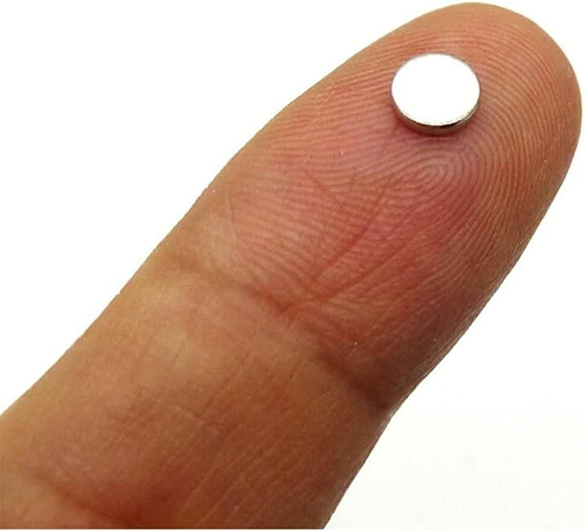
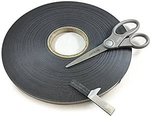
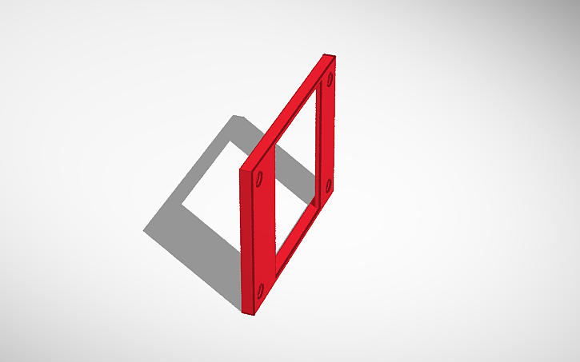
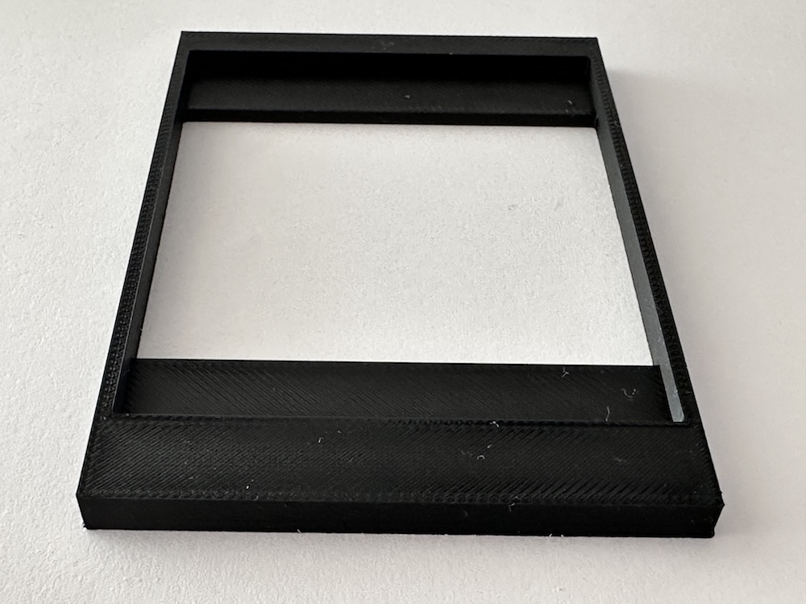
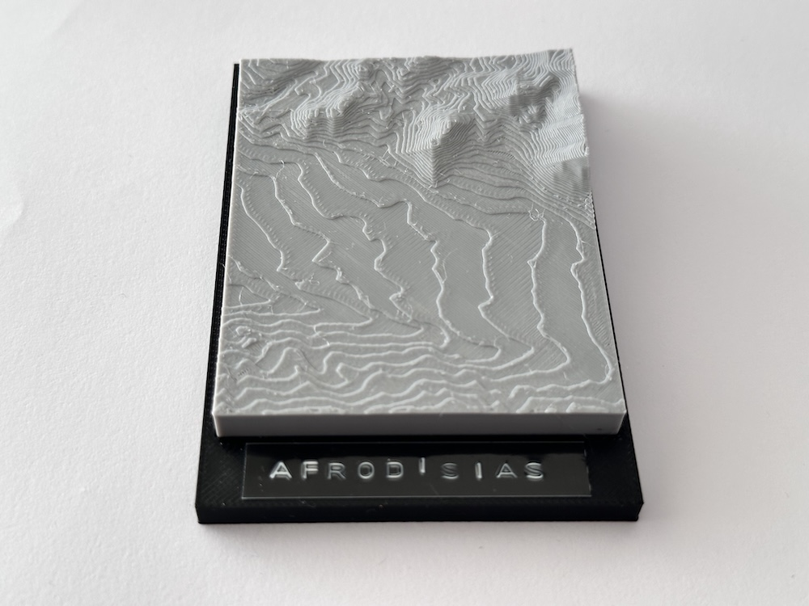

# GeoMagnet Project 🧭🗺️🧲
**Every trip leaves a memory — every map holds a story.**

This project began as a weekly tradition I share with my son: visiting ancient cities and historical sites while enjoying nature hikes. After each adventure, I mark the place on [map2stl.com](https://www.map2stl.com/), export a 3D terrain slice (STL), and print it using a 3D printer.

But that’s not all.

I also designed a custom 3D magnet frame, into which I place each printed map slice — turning every visit into a physical keepsake.

---

## ✨ Why I Created This

In an age of digital photos and fleeting stories, I wanted something tactile.  
Something I could **touch**, **collect**, and **remember**.  
This project combines:
- Bonding with my son through exploration
- Creativity through 3D design
- A personal archive of places I've truly experienced

And now, I’m sharing it with the world.

---

## 🔧 What's in This Repo?

- `frame.stl`: The 3D-printable magnet frame I designed to hold each terrain model
- Example terrain `.stl` files: Real samples from my trips
- Template files and tips for using [map2stl.com](https://www.map2stl.com/)
- Step-by-step guides for printing and customizing your magnets

---

## 🧲 How I Do It

1. I go to [map2stl.com](https://www.map2stl.com/) and select the area I visited
2. Export the STL model of the terrain
3. Print the model and the `frame.stl`
4. Insert the map slice into the frame
5. Attach a magnet and display it proudly

---

## ⚙️ Recommended map2stl Settings

When generating terrain models with [map2stl](https://www.map2stl.com/), I use the following settings:

- **Box Scale (Sampling Rate):** `2`
- **Model Scale:** `2.00`
- **Vertical Scale Factor:** `2.0`
- **Base Height:** `3 mm`
- **Water Drop:** `0 mm`

> Note: Coordinates change per location, but I keep these settings consistent to ensure uniformity across all magnets.

---

## 🧱 Materials & Printing Tips

To build your own GeoMagnet, you’ll need:

- **3D printer** (FDM with PLA/ABS recommended)
- **Print bed size:** 150x150mm or larger
- **Magnets:**
  - I use **5mm x 1mm neodymium magnets**
  - Example (Turkey): [Amazon TR – Magnet Set](https://www.amazon.com.tr/gp/product/B0BHSLGWDK?smid=A2WWZK4XHM25LW&psc=1)
  - If you’re outside Turkey, **any 5mm diameter x 1mm thick neodymium magnet** should work
- **Glue (optional) or Thin double-sided tape** to fix magnets securely

> The frame’s magnet slot has a slight tolerance for a snug press-fit. 

Example Magnet Product Image             |  Example Tabe Product Image
:-------------------------:|:-------------------------:
 | 

---
## 💡Design File & Online Tool

> I designed the product with tinkercad, you can access the design file via tinkercad from the link below.

<a href="https://www.tinkercad.com/things/a7Sl9GH4awK-geo-magnet-frame" target="_blank"><a/>

--
## Examples

Example Magnet Product Image             |  Example Tabe Product Image
:-------------------------:|:-------------------------:
 | 

---

## 📚 Coming Soon

- Blog articles for each location — with my trip notes, photos, and STL files
- New frame designs (round, vertical, labeled, etc.)
- A printable map logbook to document your growing magnet wall

---

## 🫶 Want to Join In?

Fork this repo, add your own STL files, or improve the frame designs.  
If you’re turning your adventures into prints — welcome to the club.

Let’s build a collective memory map.

---

## 📷 License

MIT — because memories should be free to share.

> _"Collect moments, not things — but if you must collect something, let it be stories you can touch."_

---

## Language

> 🇬🇧 This README is in English. For Turkish version, see [README_TR.md](README_TR.md)
